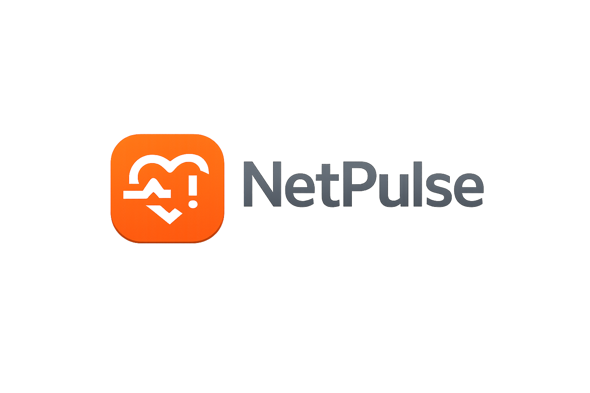

# NetPulse v0.1.2

<p align="center">
  
</p>

NetPulse is a blazing-fast, strictly local network diagnostics suite built with Electron, React, and Vite. It directly interfaces with your operating system's native networking stack (raw sockets, ICMP binaries, and TCP wrappers) to deliver precise, dependency-free telemetry directly to a modern, dark-mode desktop interface.

## 🚀 Features

### Multi-Target Ping
* **Live Dashboards:** Add and monitor multiple hosts simultaneously via ICMP using interactive sparkline charts.
* **Granular Control:** Toggle packet sizes, DF (Don't Fragment) flags, and bulk-load IP lists.
* **Latency Matrix:** High-level overview of global packet loss, p50/p95/p99 jitter percentiles, and current node health.

### Flood Test
* **Stress Diagnostics:** Execute high-frequency ICMP pacing tests (100 to 1000 pings) to isolate unstable network links.
* **Sequence Mapping:** Visual hit/miss/jitter sequence grid to quickly spot packet drop clusters.
* **Deep Metrics:** Calculates maximum loss streaks, average RTT, and evaluates severity thresholds.

### Network Topology (Trace)
* **Visual Traceroute:** Parses system traceroute data on the fly, rendering individual hops with their respective IPs and status bars.
* **CSV Export:** Save topology reports to disk for external auditing.

### Advanced Analytics
* **TCP Ping (SYN Reachability):** Bypass ICMP blocks by probing specific TCP ports directly.
* **MTR-Style Analysis:** Multi-round hop-by-hop latency and packet loss synthesis.
* **Port Scanner Lite:** Quickly interrogate common ports (e.g., 22, 80, 443, 3389) across any edge node.
* **DNS Toolkit:** 
  * *DNS Validation:* Query specific types (A, AAAA, MX, NS, CNAME, PTR).
  * *Split-Horizon Health:* Concurrently interrogate 1.1.1.1, 8.8.8.8, and local OS resolvers to detect DNS poisoning or caching mismatch.
  * *DMARC Inspector:* Fetch and validate email security TXT records.

### Registry & Hardware Identity
* **Multi-Tier WHOIS:** 100% API-free. Queries international registration databases using an internal RDAP HTTPS pipeline, automatically falling back to raw Port 43 TCP socket streams if RDAP fails.
* **MAC OUI Matcher:** Millisecond-level hardware manufacturer lookups leveraging an embedded, highly optimized native SQLite (`vendordb`) table running directly on the filesystem.

## ⚙️ Architecture & Security

- `contextIsolation: true` & `nodeIntegration: false`: Strict boundary separation between the Node backend and React frontend via IPC Context Bridge.
- **Dependency-Free Networking:** Uses Zero external API keys. All network operations (aside from WHOIS HTTPS RDAP) are executed locally via Node's `child_process`, `net`, `dgram`, and `dns` standard libraries.

## 💻 Installation & Build Instructions

### Prerequisites
* Node.js 18+
* npm or yarn

### Development
1. Clone the repository and install dependencies:
   ```bash
   npm install
   ```
2. Spin up the Vite dev server and Electron shell:
   ```bash
   npm run dev
   ```

### Production Build
Compile a standalone executable via `electron-builder` for your operating system:
```bash
npm run build
```

**Build Output:**
* `/dist`: Frontend React bundle.
* `/release`: Executable installer `.exe` / `.dmg` (depending on the build environment platform).

*Bundling notes:* The `oui-database.sqlite` relies on SQLite native bindings and is automatically parsed into `extraResources` alongside the ASAR archive for production deployment. Windows target architectures explicitly include `x64` and `arm64`.

## Built with AI

This application was built using an AI-assisted development workflow powered by Antigravity and Codex. AI accelerated the creation of the codebase, enabling faster iteration and a consistent architecture across the project.

All system design, validation, and testing remain under developer control. The application runs locally and deterministically, with no external AI services involved during normal operation, ensuring reliability and data privacy.

## 📄 License
MIT. See `LICENSE` for more information.

---
*NetPulse by Gabriel Chavez • Developed in Mexico with love*
