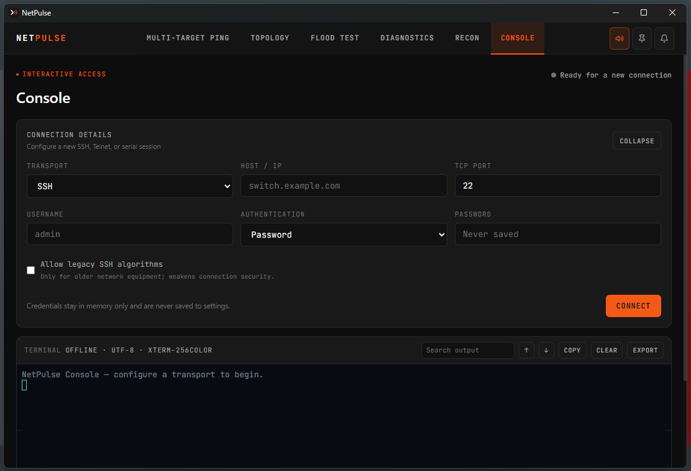

# NetPulse

<p align="center">
  <a href="LICENSE">
    
  </a>
  <a href="https://github.com/GChavez0210/NetPulse/releases">
    
  </a>
</p>

<p align="center">

<p align="center">
  <strong>Cross-platform network diagnostics for engineers, administrators, and enthusiasts.</strong>
</p>

<p align="center">
  Ping • Traceroute • DNS • TCP • TLS • WHOIS • Recon • Console
</p>

---

NetPulse is a desktop network diagnostics toolkit built with Tauri, React, and Rust.

It combines the tools network engineers use every day—ping, traceroute, DNS analysis, TCP diagnostics, TLS inspection, WHOIS/RDAP lookups, passive reconnaissance, and interactive SSH/Telnet/serial console access—into a single cross-platform desktop application while leveraging the operating system's native networking stack for accurate results.

Designed to be lightweight, fast, and dependency-free, NetPulse delivers professional-grade diagnostics without requiring command-line expertise.

## Download

Download the latest release from:

https://github.com/GChavez0210/NetPulse/releases

### Supported Platforms

| Platform | Status |
|-----------|---------|
| Windows 10/11 (x64) | ✅ |
| Linux (x64) | ✅ |
| macOS Apple Silicon | ✅ |
| macOS Intel | 🟡 Source Build |

---

## Screenshots




---

## Features

### Multi-Target Ping

Monitor multiple hosts simultaneously with live latency tracking, packet loss analysis, configurable intervals, custom aliases, host groups, notifications, and audio alerts.

### Flood Test

High-frequency ICMP testing with real-time packet visualization, jitter analysis, packet loss tracking, and diagnostic summaries.

### Network Topology

Traceroute visualization with automatic GeoIP enrichment including ASN, organization, city, and country information.

### Console

Interactive terminal access to network devices over SSH, Telnet, or a serial console cable, built on xterm.js so full-screen remote programs (`vim`, `top`, paged `show run`) render correctly.

- **SSH** — password or OpenSSH private-key authentication, a real `xterm-256color` PTY that tracks window size, keepalives, and host-key verification against a standard `known_hosts` file. A first-time key prompts with its SHA-256 fingerprint; a changed key is refused outright.
- **Telnet** — full option negotiation (ECHO, SUPPRESS-GO-AHEAD, TERMINAL-TYPE, NAWS) and support for non-standard ports used by console servers.
- **Serial** — port dropdown listing adapters by manufacturer and product (`COM3 — FTDI FT232R USB UART`), defaulting to 9600 8N1, with data bits, parity, stop bits, flow control, and local echo available under advanced settings.
- Up to 16 concurrent sessions as renameable tabs, each with its own terminal and scrollback, staying live while you work in other NetPulse tabs.
- Scrollback search, clear, and transcript export — the export reports the exact path it wrote to.
- A session closed by anything other than you — an idle timeout, a reboot, a dropped link — prints a `Press R to reconnect` hint in the terminal and reconnects without retyping credentials. Closing a live tab warns first and offers to export the transcript.
- An opt-in **legacy SSH algorithms** toggle for older Cisco and HPE gear, which widens the accepted algorithm set without downgrading connections that do not need it.

Credentials are held in memory only, never written to disk, and discarded as soon as a session can no longer need them.

### Advanced Diagnostics

Includes:

- Port Checker — single-port check or multi-port sweep
- MTR-style analysis (ping + traceroute) with per-hop loss and latency
- Speed Test — download/upload throughput and latency
- DNS Toolkit — record lookups via the local resolver and Google DNS
- DNS Validation — common misconfiguration checks
- Multi-Resolver Health (Split DNS) — compares answers across resolvers
- DNSBL Blacklist Check — public DNS-based blacklists for an IPv4 address

### Recon Toolkit

Includes:

- WHOIS / RDAP Lookup — registry ownership for a hostname or IP
- ASN / Network Lookup — announcing ASN, BGP prefix, and origin network
- BGP Looking Glass — real-time route visibility from RIPE RIS collectors
- DMARC Inspector — DMARC policy tag validation
- SSL / TLS Inspector — certificate chain, expiry, SANs, and TLS version
- HTTP Headers — response headers, status, and redirect chain
- Tech Detect — web technology fingerprinting from headers and HTML
- MAC Address OUI Matcher — hardware vendor from a MAC address

Every Diagnostics and Recon tool has its own clear button that resets that tool's inputs and results.

### Notifications & Monitoring

Persistent notification center, monitor state tracking, alerting, historical session metrics, and operational visibility features.

---

## Why NetPulse?

Most network troubleshooting still requires jumping between multiple command-line tools, browser tabs, and third-party websites.

NetPulse brings common operational diagnostics into a single desktop application while remaining lightweight, fast, and fully local.

No subscriptions.

No cloud dependency.

No API keys required.

No telemetry.

---

## System Requirements

### Windows

- Windows 10 1803 or later
- Microsoft WebView2 Runtime
- 150 MB RAM available
- ~30 MB disk space

### Linux

- Modern x64 distribution
- WebKitGTK 4.1
- traceroute package
- libudev (serial port discovery in the Console tab)

### macOS

- macOS 11 Big Sur or later
- Apple Silicon supported
- Intel Macs supported via source build

---

## Building From Source

```bash
git clone https://github.com/GChavez0210/NetPulse.git
cd NetPulse
npm install
npm run dev
```

Production build:

```bash
npm run build
```

Requires:

- Node.js 18+
- Rust (stable)
- Tauri 2

---

## Built with AI

NetPulse was developed using an AI-assisted workflow leveraging Antigravity, Claude Code, and OpenAI Codex.

Architecture, implementation decisions, validation, testing, and release management remain under direct developer control.

---

## License

MIT License.

See [LICENSE](LICENSE) for details.
