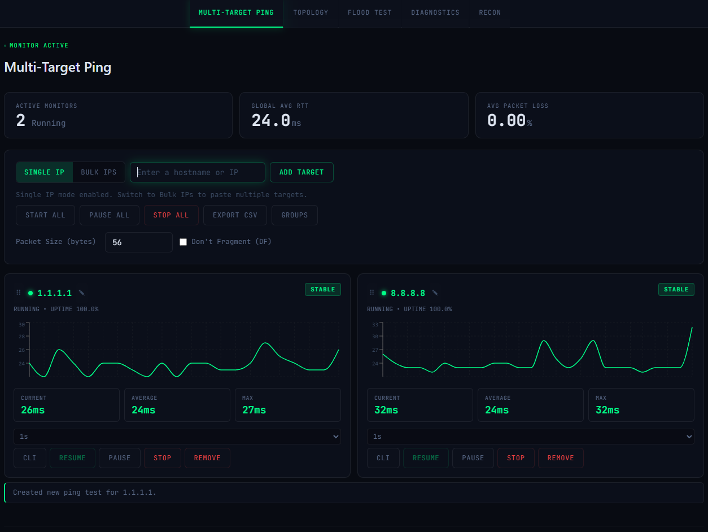
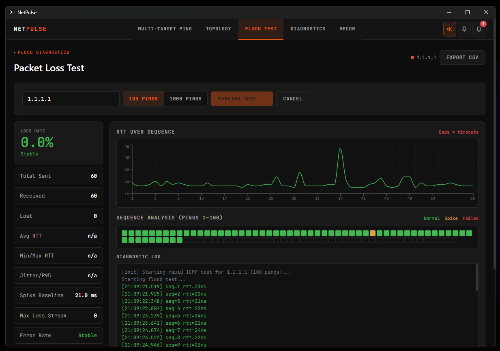
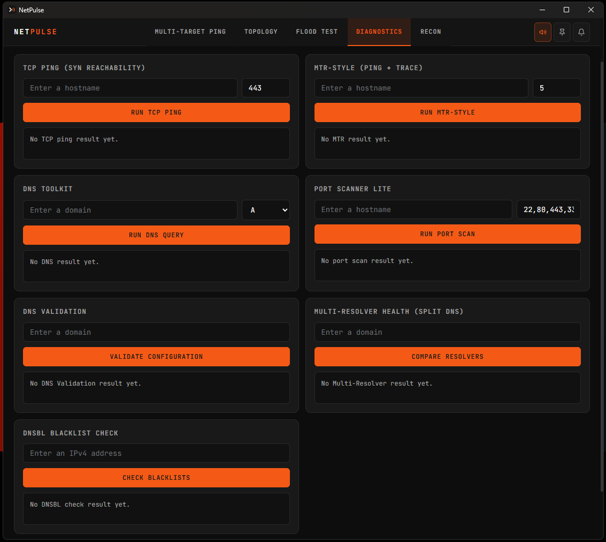
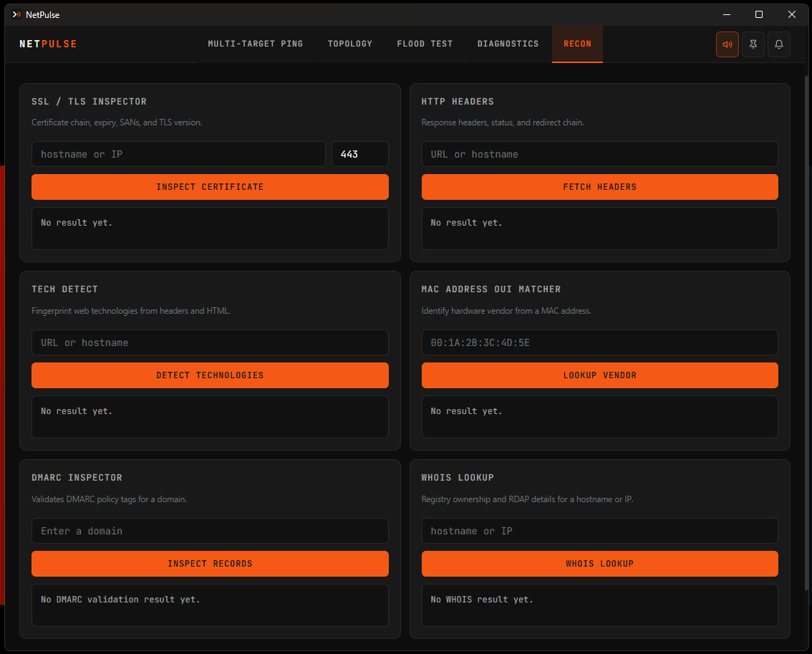

# NetPulse

<p align="center">
  <a href="LICENSE">
    
  </a>
  <a href="https://github.com/GChavez0210/NetPulse/releases">
    
  </a>
  <a href="https://github.com/GChavez0210/NetPulse/stargazers">
    
  </a>
  <a href="https://github.com/GChavez0210/NetPulse/issues">
    
  </a>
  <a href="https://buymeacoffee.com/gchavez0210">
    
  </a>
</p>

<p align="center">
  <strong>Cross-platform network diagnostics for engineers, administrators, and enthusiasts.</strong>
</p>

<p align="center">
  Ping • Traceroute • DNS • TCP • TLS • WHOIS • Recon
</p>

---

NetPulse is a desktop network diagnostics toolkit built with Tauri, React, and Rust.

It combines the tools network engineers use every day—ping, traceroute, DNS analysis, TCP diagnostics, TLS inspection, WHOIS/RDAP lookups, and passive reconnaissance—into a single cross-platform desktop application while leveraging the operating system's native networking stack for accurate results.

Designed to be lightweight, fast, and dependency-free, NetPulse delivers professional-grade diagnostics without requiring command-line expertise.

## Download

Download the latest release from:

https://github.com/GChavez0210/NetPulse/releases

### Supported Platforms

| Platform | Status |
|-----------|---------|
| Windows 10/11 (x64) | ✅ |
| Linux (x64) | ✅ |
| macOS Apple Silicon | ✅ |
| macOS Intel | 🟡 Source Build |

---

## Screenshots









---

## Features

### Multi-Target Ping

Monitor multiple hosts simultaneously with live latency tracking, packet loss analysis, configurable intervals, custom aliases, host groups, notifications, and audio alerts.

### Flood Test

High-frequency ICMP testing with real-time packet visualization, jitter analysis, packet loss tracking, and diagnostic summaries.

### Network Topology

Traceroute visualization with automatic GeoIP enrichment including ASN, organization, city, and country information.

### Advanced Diagnostics

Includes:

- TCP Ping
- MTR-style traceroute analysis
- DNS Toolkit
- Port Scanner Lite
- DNS Validation
- Multi-Resolver Health Checks
- DMARC Inspector
- WHOIS / RDAP

### Recon Toolkit

Includes:

- SSL/TLS Inspector
- HTTP Header Analysis
- Technology Detection
- MAC Address Vendor Lookup

### Notifications & Monitoring

Persistent notification center, monitor state tracking, alerting, historical session metrics, and operational visibility features.

---

## Why NetPulse?

Most network troubleshooting still requires jumping between multiple command-line tools, browser tabs, and third-party websites.

NetPulse brings common operational diagnostics into a single desktop application while remaining lightweight, fast, and fully local.

No subscriptions.

No cloud dependency.

No API keys required.

No telemetry.

---

## System Requirements

### Windows

- Windows 10 1803 or later
- Microsoft WebView2 Runtime
- 150 MB RAM available
- ~30 MB disk space

### Linux

- Modern x64 distribution
- WebKitGTK 4.1
- traceroute package

### macOS

- macOS 11 Big Sur or later
- Apple Silicon supported
- Intel Macs supported via source build

---

## Building From Source

```bash
git clone https://github.com/GChavez0210/NetPulse.git
cd NetPulse
npm install
npm run dev
```

Production build:

```bash
npm run build
```

Requires:

- Node.js 18+
- Rust (stable)
- Tauri 2

---

## Support NetPulse

NetPulse is an independent open-source project developed and maintained during personal time.

If NetPulse helps with your day-to-day troubleshooting, network operations, or learning journey, consider supporting continued development.

<p align="center">
  <a href="https://buymeacoffee.com/gchavez0210">
    
  </a>
</p>

---

## Built with AI

NetPulse was developed using an AI-assisted workflow leveraging Antigravity, Claude Code, and OpenAI Codex.

Architecture, implementation decisions, validation, testing, and release management remain under direct developer control.

---

## License

MIT License.

See [LICENSE](LICENSE) for details.
